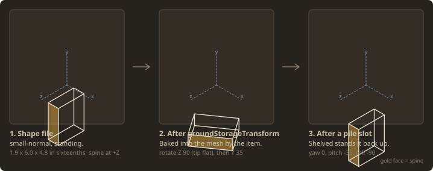

# Book Transforms

Notes on placing a book mesh in Vintage Story, written while building the floor pile. Everything
here was checked against the game's own assets: the pile layouts are traced from vanilla clutter
shapes and land within 0.0004 of a texture pixel, and the C# was re-run against an independent
model of the same maths before being trusted.

If you are only playing the mod, you want the [player guide](../player/guide.md) instead.

## The book model

Both vanilla book families — `lore-book-*` and the writable `book-*` — use one shape,
`block/clutter/bookshelves/small-normal`, and one `groundStorageTransform`. That is why they
interchange freely in a pile.

In the shape file the book **stands upright**, and its dimensions in sixteenths of a block are:

| Axis | Size | What it is |
| ---- | ---- | ---------- |
| X | 1.9 | thickness, cover to cover |
| Y | 6.0 | page height |
| Z | 4.8 | page width, spine at **+Z** |

The 1.9 matters more than it looks: every vanilla pile stacks books exactly 1.9 apart, so a layout
that uses the same ladder has books touching with no gap and no interpenetration.

## The transform stack

A book in a pile is moved twice, and the second stage has to account for the first.



**Stage 1** is the item's own `groundStorageTransform`, baked into the mesh before the block entity
ever sees it. For books that is `rotation: { x: 0, y: 35, z: 90 }` about `origin: (0.5, 0.05, 0.5)`
with a small translate — Z 90 tips the book flat, Y 35 turns it.

**Stage 2** is the pile slot, applied by `BlockEntityBookPile.genTransformationMatrices`:

```
Translate(x, y, z) · RotY(yaw) · RotX(pitch) · RotZ(roll) · Translate(-0.5, 0, -0.5)
```

The trailing translate puts the rotation through `(0.5, 0, 0.5)` — the block's horizontal centre at
floor level, **not** the book's own centre. The book's centre sits about `(0.015, 0.053, 0.049)`
off that pivot, so a yaw rotates it slightly eccentrically. That is free character in a messy pile
and a nuisance when matching vanilla exactly.

!!! warning "A slot's angles are not the book's angles"
    `yawDeg`/`pitchDeg`/`rollDeg` are whatever **cancels stage 1** and lands on the pose you want.
    Standing a book upright is the clearest case: it needs `pitch -35, roll -90`, not a plain
    `roll -90`, because the baked-in `Y 35` sits between the tip and the slot rotation.

To solve a slot for a wanted world orientation `R`:

```
RotY(yaw) · RotX(pitch) · RotZ(roll) = R · RotZ(-90) · RotY(-35)
```

then read Y-X-Z Euler angles off that product `Q`:

```
pitch = asin(-Q[1][2])
roll  = atan2(Q[1][0], Q[1][1])
yaw   = atan2(Q[0][2], Q[2][2])
```

`tools/bookpile_geometry.py` implements this, and asserts the reconstruction matches before
returning — a bad decomposition can never reach the config.

## Conventions worth knowing

These cost the most time, and none are obvious from the JSON.

**Rotation order is Z, then Y, then X.** A shape element's matrix is built `Rx · Ry · Rz`, so a
vertex meets `Rz` first. `ModelTransform` composes the same way — feeding it `rotation: (0, 35, 90)`
and pushing the book's own axes through `AsMatrix` gives:

| Book axis | Result | `Ry(35) · Rz(90)` | `Rz(90) · Ry(35)` |
| --------- | ------ | ----------------- | ----------------- |
| +Y (up) | `(-0.819, 0.000, 0.574)` | ✅ matches | `(-1.000, 0, 0)` |
| +Z (spine) | `(0.574, 0.000, 0.819)` | ✅ matches | `(0, 0.574, 0.819)` |

Getting this backwards produces poses that look plausible on axis-aligned books and fall apart the
moment one is tilted.

**`Matrixf` is a mutating builder that post-multiplies.** `new Matrixf().RotateYDeg(a).RotateXDeg(b)`
yields `Ry · Rx`, and each call changes the instance rather than returning a fresh one. Two poses
from one instance need two instances.

**`Matrixf.Values` is column-major.** The contribution of each local axis to world Y lives at
indices `1`, `5`, `9` — that is row 1, not column 1.

**`origin` is a pivot, `translation` is applied after the rotation.** Both are in block units.

## Tracing a vanilla clutter pile

Vanilla's `bookpile1` … `bookpile5` are a free source of hand-authored layouts, and they follow one
convention throughout: **`rotationOrigin = from + (2.6, 3.0, 0)`**, which holds for every book in
every one of those shapes. Books sit at `rotationZ: 90` with `rotationY` carrying all the variation.

The lesson from reading them: **vanilla piles get their messy look almost entirely from yaw
spread**, not from positional scatter. `bookpile1` spreads yaw across about 160° while its four
columns wander by less than a texture pixel.

To convert an element into a slot, take its world bounding box under `Rx · Ry · Rz` about its
`rotationOrigin`, then place ours on the same horizontal centre with its base at the same height.
Read each element's own child bounds rather than assuming the standard book box — `bookpile5`
contains one larger model, and assuming otherwise puts it in the wrong place.

Beware `rotationY` sign when reusing vanilla angles: a slot needs `rotationY - 35` to cancel the
bake.

## Collision height for a tilted pose

A pile's selection box has to cover the tallest book, and once a layout stands books upright or
props them at an angle you cannot assume a flat 1.9/16.

The trap is using the mesh's **bounding box**. The ground transform already yawed the book 35°, so
its AABB is 0.479 wide against the book's true 0.375 — rotate that and the height overshoots by up
to 0.141. Use the book's own oriented half-extents `(0.1875, 0.059375, 0.15)` and turn them by
`slotRotation · RotY(35)`:

```
reach = |m[1]| · halfLength + |m[5]| · halfThickness + |m[9]| · halfDepth
top   = slot.Y + centreHeight + reach
```

`BookPileUtil.SlotTopHeight` does this and is exact for every pose in the shipped config.

## Held transforms

The same conventions govern the held book stack, with different anchors. The shapes centre on
`x/z = 8` with their base at `y = 0`, so a single transform can anchor on something meaningful:

| Transform | Origin | What it anchors |
| --------- | ------ | --------------- |
| `guiTransform` | `(0.5, 0.132, 0.5)` | the stack's visual centre, so the icon sits centred in a slot |
| `fpHandTransform` | `(0.5, 0, 0.5)` | the base, so the stack rests on the palm in first person |
| `tpHandTransform` | `(0.5, 0, 0.5)` | the base, with `rotation.z: -90` laying it across the hand |
| `tpOffHandTransform` | `(0.5, 0, 0.5)` | the same for the left hand, mirrored a few degrees |
| `groundTransform` | `(0.5, 0, 0.5)` | the base, scaled up for the dropped item |

One thing that is easy to assume and is **not** true of `ModelTransform` itself: scale does not
multiply the translation. Building the same transform at scale 1, 2 and 4 leaves the matrix's
translation column at exactly the value you wrote.

```
translate 0.5, scale 1  ->  translation column = (0.5000, 0.0000, 0.0000)
translate 0.5, scale 2  ->  translation column = (0.5000, 0.0000, 0.0000)
translate 0.5, scale 4  ->  translation column = (0.5000, 0.0000, 0.0000)
```

If a held item appears to move when you rescale it, the coupling is coming from further down the
render path — the hand attach point composes its own matrices on top, and third-person adds a yaw
of its own, which is why `tpHandTransform` numbers look nothing like the first-person ones. Tune
hand transforms against the running game rather than reasoning about them in isolation.

## Regenerating the figures

Every diagram on this page is generated from the mod source, so it cannot drift from what the game
draws:

```bash
make docs-figures
```

| Tool | Reads | Writes |
| ---- | ----- | ------ |
| `tools/render_layout_icons.py` | the Cairo bar tables in `BookPileLayoutIcons.cs` | `bookpile-layouts.svg` |
| `tools/render_layout_shapes.py` | `config/bookpile-layout.json` | `bookpile-shapes.svg` |
| `tools/render_transform_diagram.py` | `tools/bookpile_geometry.py` | `book-transforms.svg` |
