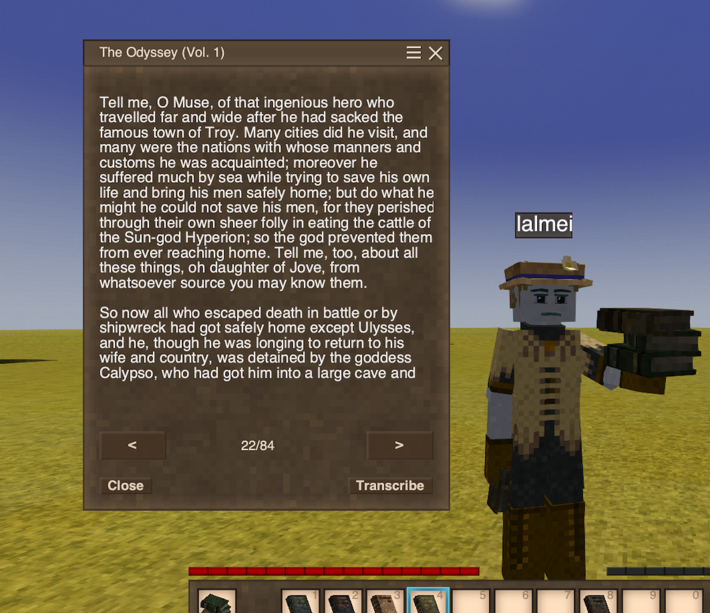
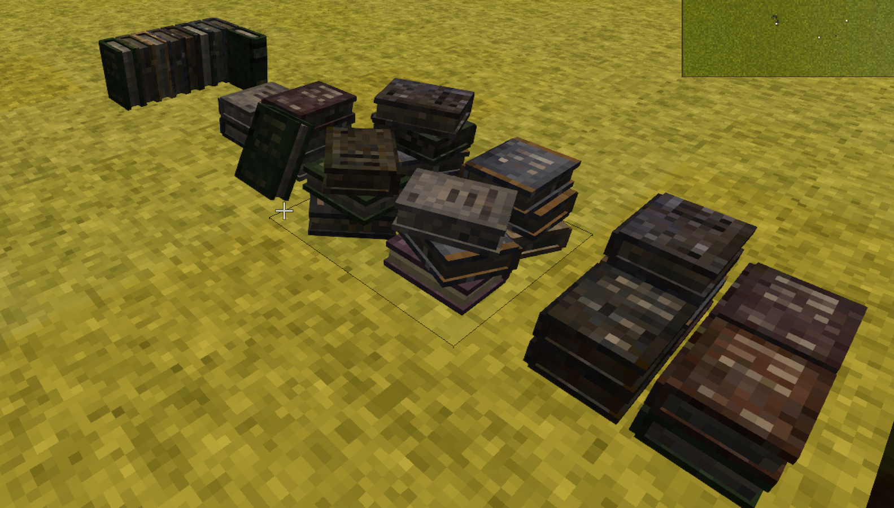
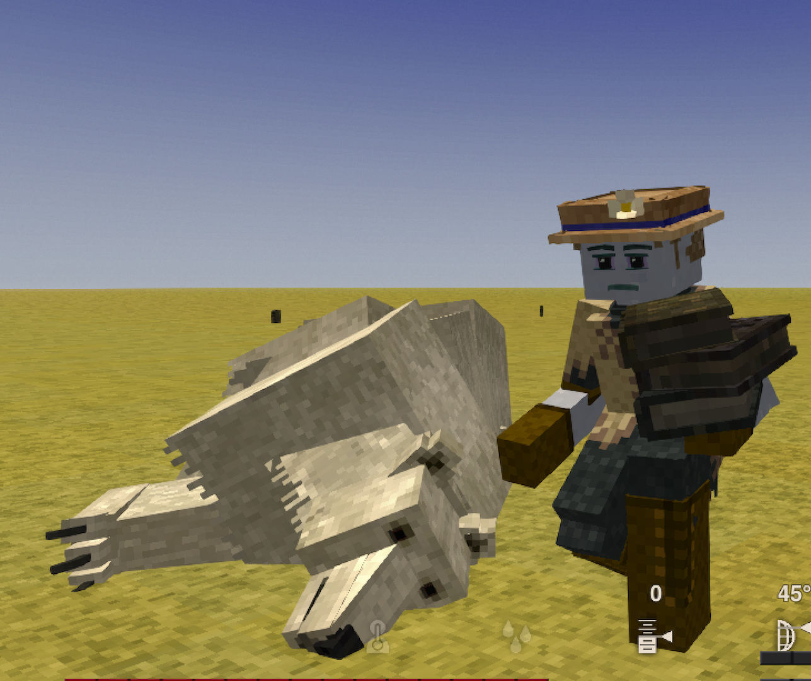
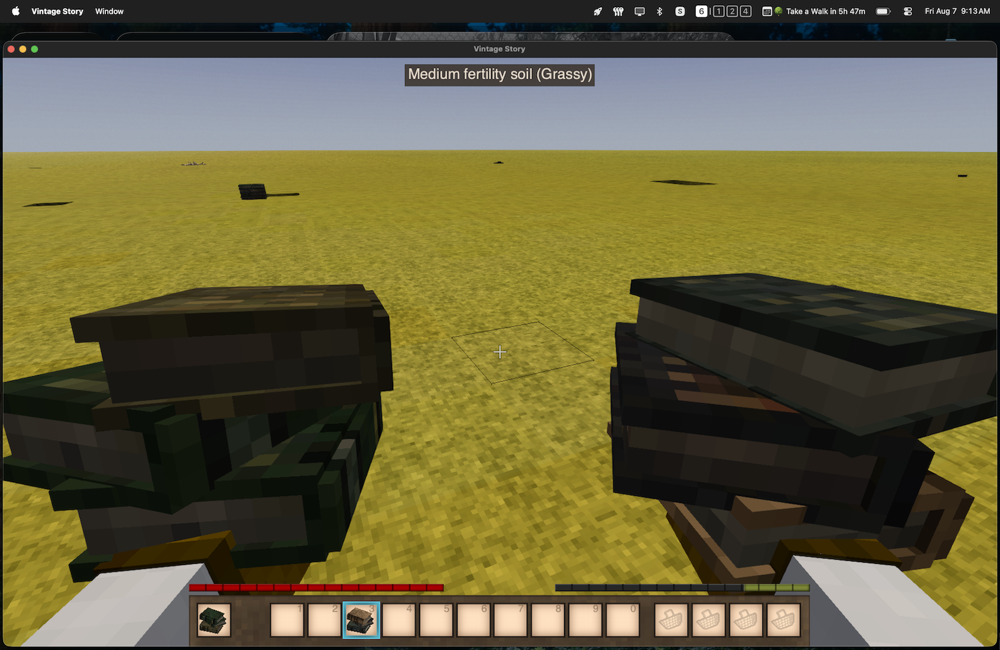

# Liber Terra Docs

Don't you wish you could actually *read* more books in Vintage Story? Liber Terra fills ruins, bony soil, and creative tabs with **75 pre-1300 CE works** — **510 readable volumes** sourced from Project Gutenberg.

  <a href="player/guide/#the-library">
    
    Read the classics
  </a>
  <a href="player/guide/#book-piles">
    
    Stack book piles
  </a>
  <a href="player/guide/#throwing-books">
    
    Throw books
  </a>
  <a href="player/guide/#book-piles">
    
    Keep them neat
  </a>

## Player Docs

- [Player Guide](player/guide.md): library contents, loot, throwing, and book piles.
- [Command Reference](player/commands.md): `/liberterra` commands for listing and giving volumes.

Requires **Vintage Story 1.22.x**.
