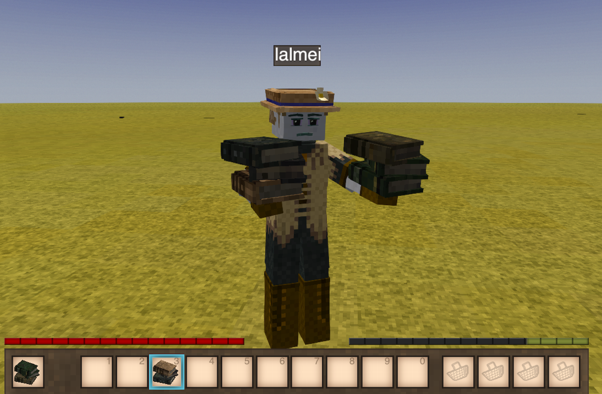
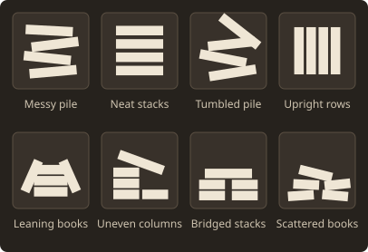
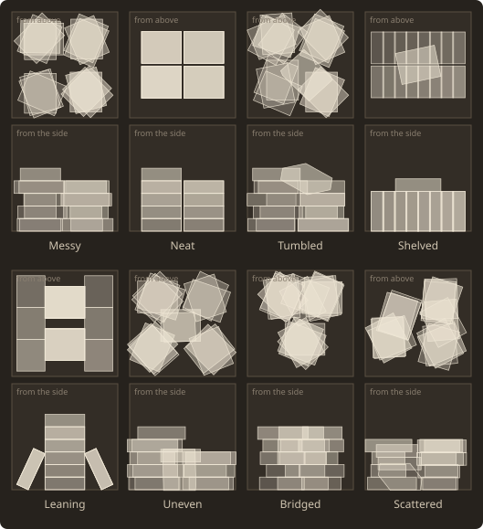

# Liber Terra Player Guide

Liber Terra assumes Vintage Story's setting is roughly post-1300s Earth (or when it last matched our history) and fills the shelves with literature from before that cutoff — public-domain editions from Project Gutenberg.

Epics. Chronicles. Romances. Sagas. If someone in the 1200s could have owned it, and Gutenberg still has a clean edition, it's fair game.

!!! warning "Lore dilution"
    Liber Terra adds many books to ruin and bony-soil loot. That makes it harder to find vanilla lore, since those pools are diluted.

    The short version: vanilla ruin lore appears **0.667× as often**, Better Ruins lore **0.969× as often**, and existing bony-soil drops are **not diluted**. See [Where Books Turn Up](#where-books-turn-up) for the exact weights.

## What You Get

- **75 pre-1300 CE works, 510 readable volumes**
- Creative inventory under the **Liber Terra** tab — real lore books with aged/rotten covers
- One **Liber Terra: Random Library Book** stackrandomizer that rolls any volume and cover color
- Rare world loot from bony soil panning, vanilla ruin chests, and Better Ruins chests
- Lore books are **throwable** like stones (hold use); tap use still opens them to read
- **Book piles** on the floor — sneak + place any book into stacks of up to 17, in eight layouts

## The Library

Long texts are split so a single book stays readable in the GUI — Heimskringla alone is 25 volumes, so "collect the whole set" is a real project.

| Tradition | Works | Volumes | Highlights |
| ------------------- | ----: | ------: | ---------- |
| Old English | 10 | 80 | Beowulf, the Anglo-Saxon Chronicle, Bede, Ælfric's homilies |
| Early Middle English | 4 | 31 | Layamon's Brut, Havelok the Dane, King Horn |
| Old French | 8 | 45 | The Song of Roland, Chrétien de Troyes, Marie de France, Wace |
| Middle High German | 3 | 31 | The Nibelungenlied, Wolfram's Parzival |
| Old Norse | 12 | 77 | Heimskringla, Burnt Njal, Grettir, both Eddas |
| Welsh | 2 | 11 | The Mabinogion, Historia Brittonum |
| Iberian | 1 | 10 | Chronicle of the Cid |
| Medieval Latin | 22 | 119 | Boethius, Gerald of Wales, Villehardouin, Malmesbury, monastic rules |
| Classical Latin | 8 | 52 | Virgil, Lucretius, Caesar, Cicero, Horace |
| Classical Greek | 5 | 54 | The Iliad, The Odyssey, Plato, Aesop, Marcus Aurelius |
| **Total** | **75** | **510** | |

In game, `/liberterra list` prints the same catalog. The full work list with Gutenberg sources is on [The Library](library.md) page.

## Where Books Turn Up

| Source | Liber Terra chance | Existing loot retained | Weights |
| ------ | ------------------ | ---------------------- | ------- |
| **Bony soil panning** | **~1% per pan** | **1.000×** (unchanged) | An independent drop added to every `bonysoil` variant; it does not compete with existing drops |
| **Vanilla ruin lore** | **33.3%** of lore rolls | **0.667×** the vanilla rate (33.3% less) | `0.5 / (1.0 + 0.5)` in the `villager`, `tobias`, `research`, `diaries`, and `jonas` pools |
| **Better Ruins ruin lore** | **3.09%** of `newlore` rolls | **0.969×** the existing rate (3.09% less) | `8 / (251 + 8)` in Better Ruins 0.6.3; only applies if that mod is installed |

Every source rolls the same **Liber Terra: Random Library Book** randomizer, so any volume can show up in any aged or rotten cover.

## Throwing Books

Tap use to read a lore book. Hold use (about as long as throwing a stone), then release, to throw it. Thrown books always drop on impact so volumes are not destroyed.

## Book Piles

Sneak + right-click a book onto the ground to start a floor pile. Add more the same way; right-click empty-handed to take from the top. Ctrl adds or takes several at once. Capacity is **17** mixed volumes per block, and every cover renders from the real book sitting there — so a pile of the Iliad looks like a pile of the Iliad.

A held stack of books piles too: each sneak + right-click lays its top book down and re-wraps whatever is still in your hands, so an armful becomes a pile without a trip through your inventory.

Any book piles, not just the ones you find: the writable `book-*` colours you make and sign go in alongside lore books. Scrolls, paper, letters and envelopes do not — they never lie flat, so they would stand on end in the stack.

### Layouts

Look at a pile and press **F** to change how the books are arranged. With a book in hand you get the picker below; with **both hands empty** the same key steps to the next layout.

| Layout | What it looks like |
| ------ | ------------------ |
| **Messy** | Four leaning columns with a book crowning one of them. The default. |
| **Neat** | Four tidy four-book stacks, one per quarter of the block, squared to the world axes. |
| **Tumbled** | The same skeleton as Messy with the left half knocked about. |
| **Shelved** | Books stood upright in two back-to-back rows, spines facing out. The back row fills first, so eight books read as one tidy row. |
| **Leaning** | Two tall stacks down the middle with books propped against their long faces. |
| **Uneven** | Columns of unequal height with a book slanted across them. |
| **Bridged** | Two low stacks with a pair of books bridging the gap above them. |
| **Scattered** | Spread low and wide, with one book slumped almost flat. |

Five of these are traced from the clutter book piles the base game already places in ruins, so a pile you build can match one you found. Messy, Uneven, Bridged, Scattered and Tumbled reproduce `bookpile1` through `bookpile5` exactly at those piles' own book counts — 16, 12, 8, 7 and 17 — and keep growing in the same character beyond. Neat, Shelved and Leaning are ours.

Plan and elevation of each, with the books shaded light to dark in the order they fill:

Looking at a pile also lists what is in it, folding repeats together. Turn on extended debug info and it names every book against its slot and height instead.

Worlds that already had lore books on the floor in vanilla Quadrants ground storage keep those piles; take and break them as usual. New books go into Liber Terra piles instead.

## Other Book Mods

None of these are required. Each one is wired up only when it is actually installed, so the list below is what changes if you happen to run it alongside Liber Terra.

| Mod | What Liber Terra does about it |
| --- | --- |
| [Better Ruins](https://mods.vintagestory.at/betterruins) | Library books turn up in its ruin chests — see [Where Books Turn Up](#where-books-turn-up). |
| [Bookbinders](https://mods.vintagestory.at/bookbinders) | Its books pile, carry and throw exactly like vanilla's, in their own covers. The collection moves into its **Library** creative tab, and found lore books burn on the same terms it gives written ones. |
| [Book Trader](https://mods.vintagestory.at/show/mod/13893) | The trader stocks twelve library books: six works that are complete in a single volume, and first volumes of six long sets. It does not buy them — that mod only buys books a player wrote, and library books are found, not made. |

!!! note "Book Trader is behind on versions"
    Book Trader's latest release targets 1.19.x and is reported not to load on 1.22. The wiring above is shipped and inert until the mod catches up; it costs nothing in the meantime.

Bookbinders' books count as books everywhere Liber Terra asks the question, because it builds on the same `book-*` naming vanilla uses. Any other mod that does the same gets the same treatment without being named.

## Install

1. Grab the latest `LiberTerra-*.zip` from [Releases](https://github.com/lalmei/liber-terra/releases).
2. Drop the zip in your Vintage Story `Mods` folder, or extract it to `Mods/LiberTerra`.
3. Launch the game and enable **Liber Terra** in the mod manager.
